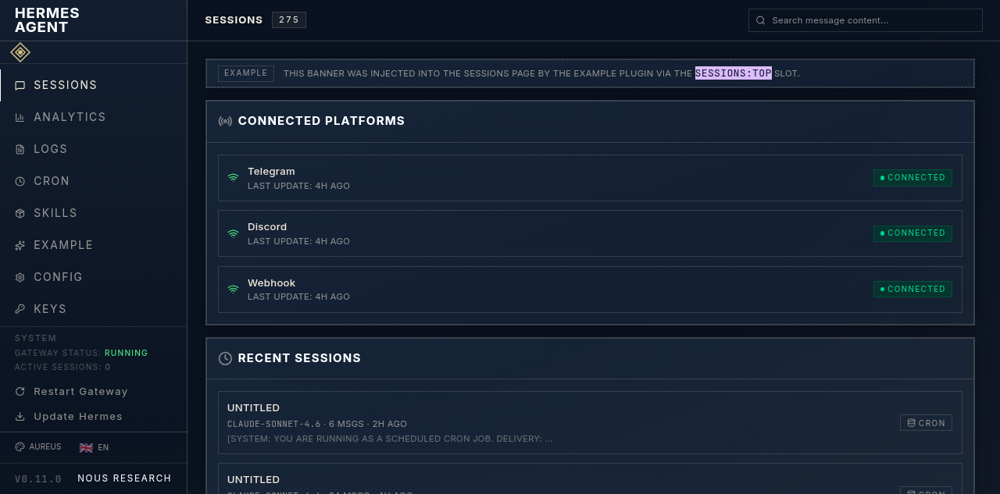
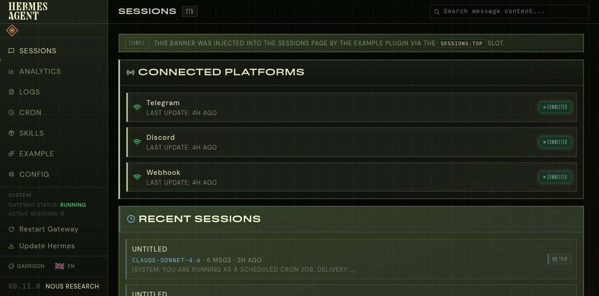
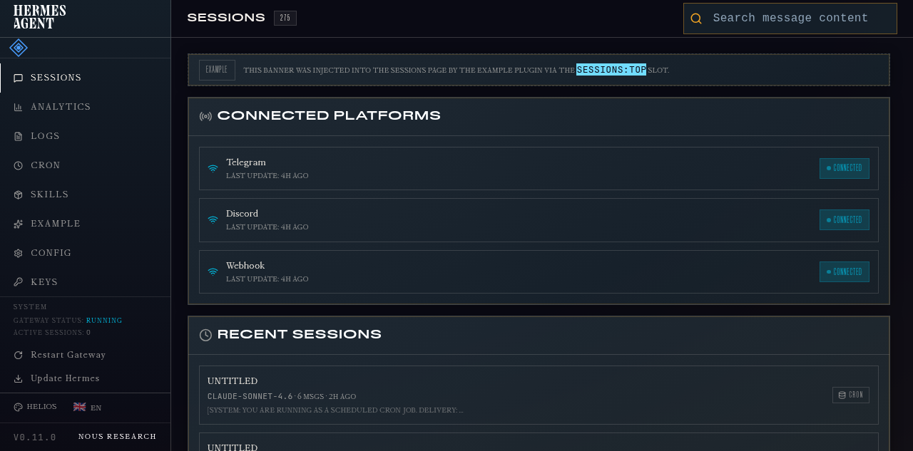
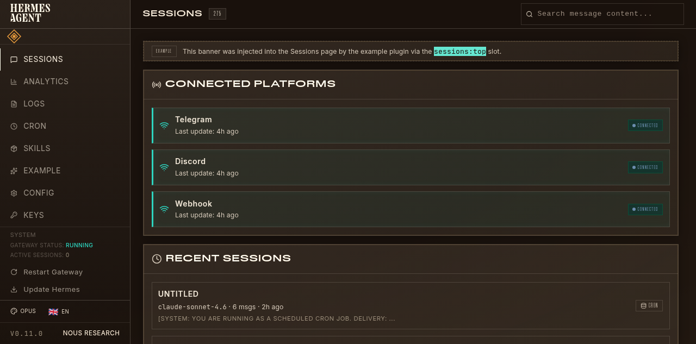
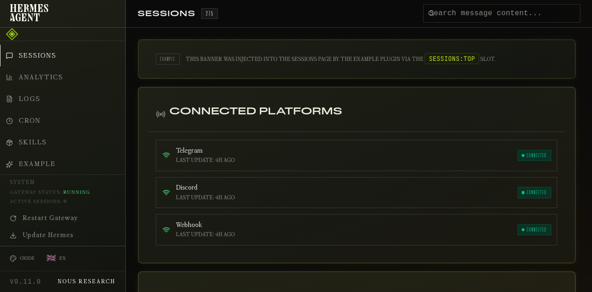

# Hermes Dashboard Themes

Custom themes for the Hermes Agent dashboard. Five carefully crafted themes — all accessibility-first with WCAG AA/AAA contrast, colorblind-safe palettes, and elder-friendly sizing.

## Theme Gallery

### 001 — Aureus
**Gold + Teal** · Warm golden cosmic command center — high contrast, colorblind-safe, elder-friendly



---

### 002 — Garrison
**Terracotta + Blue** · Bright olive command center — high-contrast earth tones with warm terracotta accent



---

### 003 — Helios
**Amber + Blue** · Deep navy command center — amber-gold accent, high contrast, colorblind-safe



---

### 004 — Opus
**Gold + Orange** · Luxurious golden fintech command center — high contrast, colorblind-safe, elder-friendly



---

### 005 — Oxide
**Chartreuse** · Acidic chartreuse on warm-black — readable command center for long-term daily use



---

## Quick Reference

| # | Name | Accent | Vibe |
|---|------|--------|------|
| 001 | Aureus | Gold + Teal | Warm golden cosmic |
| 002 | Garrison | Terracotta + Blue | Earthy olive command |
| 003 | Helios | Amber + Blue | Navy with amber-gold |
| 004 | Opus | Gold + Orange | Luxurious fintech |
| 005 | Oxide | Chartreuse | Acidic green on black |

## Installation

```bash
# 1. Copy theme files
cp *.yaml ~/.hermes/dashboard-themes/

# 2. Copy background images
cp bg-assets/*.png ~/.hermes/hermes-agent/web/public/ds-assets/

# 3. Rebuild and restart
cd ~/.hermes/hermes-agent/web && npm run build
hermes dashboard --no-open
```

Select a theme from the picker at http://127.0.0.1:9119.

## Design Principles

All five themes share these standards:

- **WCAG AA/AAA** contrast ratios throughout
- **Colorblind-safe** palettes (tested with deuteranopia, protanopia, tritanopia simulators)
- **Elder-friendly** — 15–17px base font, 1.6+ line-height, generous spacing
- **2px focus rings** for keyboard navigation
- **Hue-based section identity** — each section gets its own hue family
- **Theme-only changes** — YAML customCSS only, no Hermes source modifications

## File Structure

```
.
├── aureus.yaml              # 001 — Aureus theme definition
├── garrison.yaml            # 002 — Garrison theme definition
├── helios.yaml              # 003 — Helios theme definition
├── opus.yaml                # 004 — Opus theme definition
├── oxide.yaml               # 005 — Oxide theme definition
├── bg-assets/               # Background images (001bg.png – 005bg.png)
├── reference-images/        # Theme screenshots for documentation
│   ├── 001-aureus.png
│   ├── 002-garrison.png
│   ├── 003-helios.png
│   ├── 004-opus.png
│   └── 005-oxide.png
└── README.md
```
